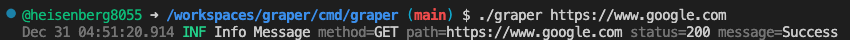
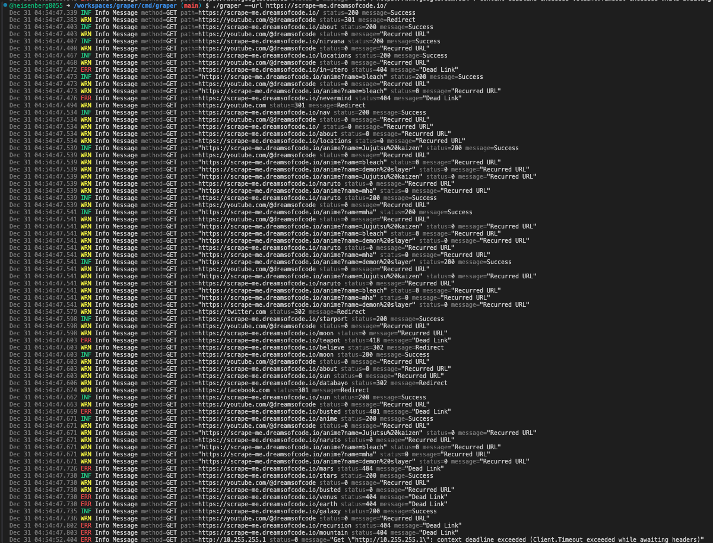
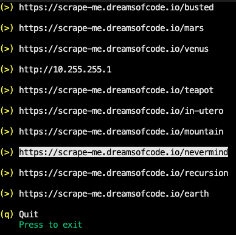

# 🦂Graper

[](https://goreportcard.com/report/github.com/heisenberg8055/graper)

Graper is a command-line web scraper tool written in golang to detect deld links in a website(4xx or 5xx).

https://github.com/user-attachments/assets/a56346ae-789b-4b10-b51d-f1043f56cd24

## Overview

The webscraper recursively check every anchor tag on the website found on every page that belongs to the same domain as the website. If a page is on a different domain, the page itself is checked that it's valid, but none of the links on that page is checked.Used Go routines to speed up the process. Running each page processing in it's own go routine, and passing the links through a channel to be then parsed or checked.

<video controls width="600">
  <source src="resources/giphy.mp4" type="video/mp4">
  Your browser does not support the video tag.
</video>

## Table of Contents

- [📋Features](#📋features)
- [🌳Structure](#🌳structure)
- [🛠️Installation](#🛠️installation)
- [🧩Supported Commands](#🧩supported-commands)
- [📊Usage](#📊usage)
  - [Single URL](#check-single-url)
  - [Recursive Check](#check-url-recursively)
- [📚Contributing](#📚contributing)

## 📋Features

- 🚀 Fast, concurrent scraping using Go routines
- ♾️ Prevent any infinite loops for repeated links
- ❎ Cross platform compatibility
- 🧩 Cli support for fast and effecient runtime
- 🖥️ Display list of deadlinks after execution
- 🪵Logs all the scraped url in the terminal(same domain)

## 🌳Structure

```bash
.
├── cmd             # Main Application (github.com/heisenberg8055/graper)
│   
└── internal        # Internal packages
    │   
    ├── api         # Http Client for scraping (net/http)
    │   
    ├── cobra-cli   # CLI application interface (github.com/spf13/cobra)
    │   
    ├── crawler     # Web Crawler Handler
    │   
    ├── log         # For logging scraped urls (slog)
    │   
    ├── parser      # For parsing html body (golang.org/x/net)
    │   
    └── tview       # Terminal ui (github.com/rivo/tview)

```

## 🛠️Installation
```bash
# Clone the repository
git clone https://github.com/heisenberg8055/graper.git
cd graper

# Install Dependencies
go mod download

# Navigate to main
cd cmd/graper 

# Build the project
go build

```

## 🧩Supported Commands
| Command                  | Description                                    |
|-------------------------|------------------------------------------------|
| **graper [url]**         | crawler checks the single url for deadlinks                                                                  |
| **graper --url/-r [url]**| crawler recursively checks the given url for deadlinks of same domain                                                   |
| **graper --help/-h**     | shows application usage                         |

## 📊Usage
Graper uses a command based structure in terminal, where the primary command (`scraper`) is followed by flags(`--url`, `-r`, `--help`, `-h`)

### Check Single URL

To perform a check for single url

```bash
./graper URL
```


### Check URL Recursively 

To perform a deadlink checks for url recursively

```bash
./graper --url URL
```

or

```bash
./graper -r URL
```




## 🚶Next steps

- [ ] Currently the webscraper supports non JS rendered web pages. In futute need to support JS rendered pages using headless browsers like puppeteer or playwright.

## 📚Contributing

Your feedback is valuable! If you encounter a bug, have questions, or want to suggest a feature, please open an issue on the repository.

When raising an issue, please provide:

- A clear description of the problem or idea.
- Steps to reproduce (if reporting a bug).
- Any other relevant details, such as logs or screenshots.

Thank you for helping improve this tool!
